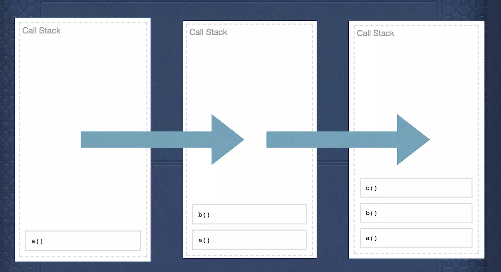
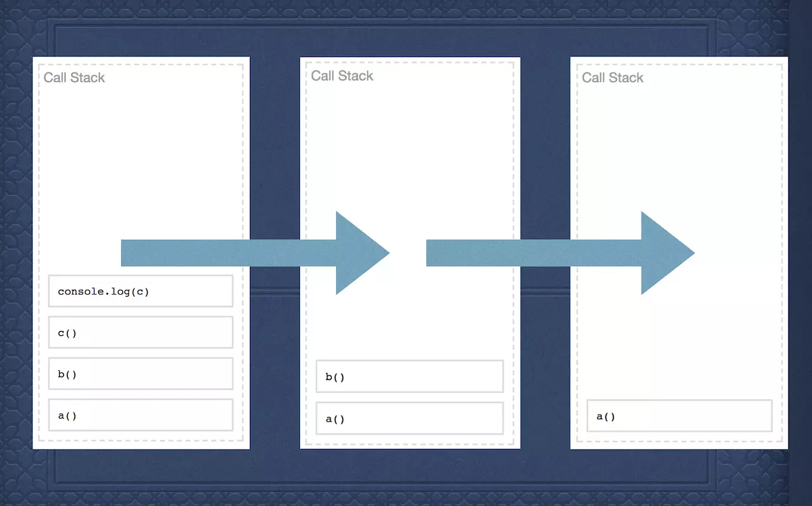
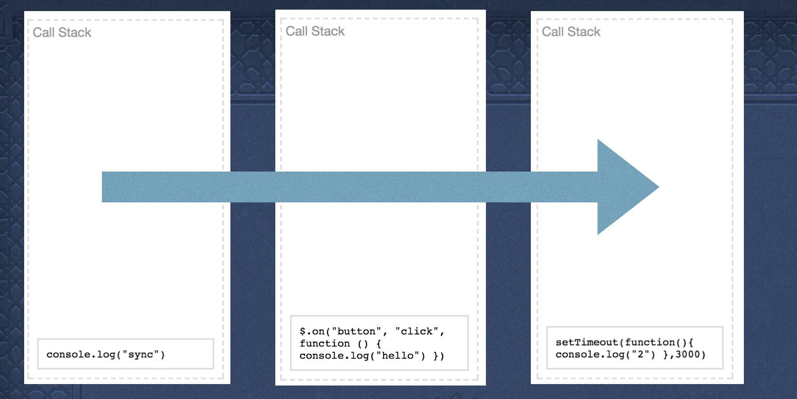
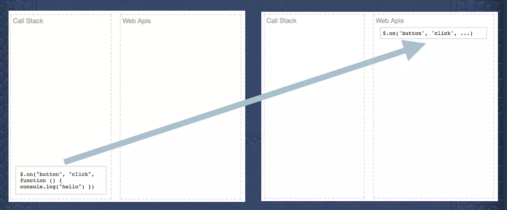
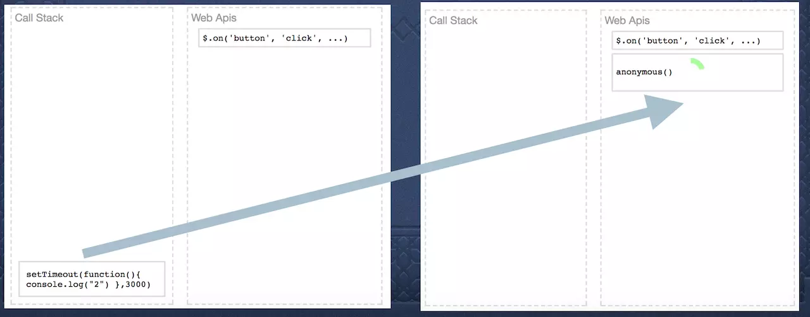
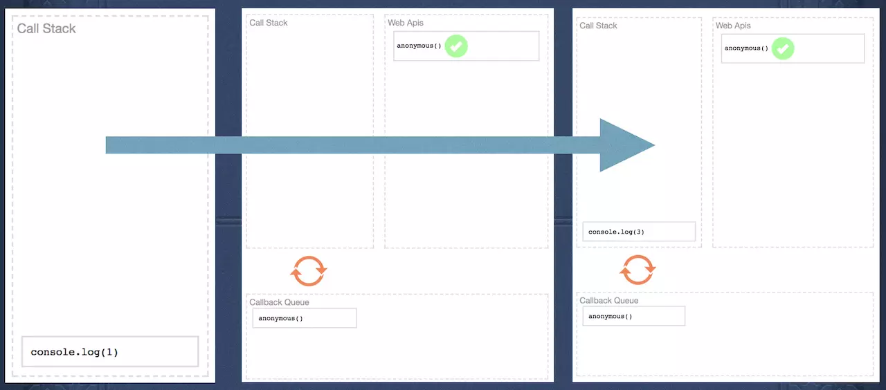
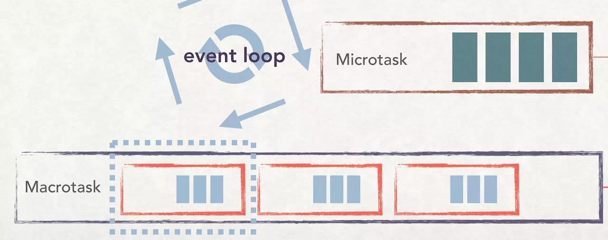

# [JS 的 EventLoop](https://juejin.im/post/5a6309f76fb9a01cab2858b1)

- [JavaScript 是单线程、异步、非阻塞、解释型脚本语言](https://juejin.im/post/5be5a0b96fb9a049d518febc)

> 名词介绍

- stack（栈）先进后出
- queue（队列）先进先出
- heap(堆)

```javascript

    function a() {
        b();
    }

    function b() {
        c();
    }

    function c() {
        console.log('c')
    }

    a();

```


- 有入栈，就要有出栈，当函数c执行完，开始出栈



## 当执行栈遇到异步

```javascript

console.log('sync');

$('#button').on('click', function() {
    console.log('hello');
})

setTimeout(function() {
    console.log('2')
}, 0)

```

- 执行顺序如下



- 观察此时的执行栈效果，和上面的函数嵌套有显著区别
1. console.log("sync")的语句，不会被压入到执行栈底部，因为console已经执行结束了
2. click和settimeout都入栈了，但它们内部的console没有入栈的，这说明他们没有执行完
3. 如果click没有执行完，那为什么setTimeout会入栈，不应该被阻塞吗？
答案是：当浏览器在执行栈执行的时候，发现有异步任务之后，会交给webapi去维护，而执行栈则继续执行后面的任务



- 同样，setTimeout同样会被添加到webapi中



- webapi是浏览器自己实现的功能，这里专门维护事件。

## 回调队列callback queue

> `setTimeout执行结束的时候，是不是就应该回到执行栈，进行执行输出呢？`

- 答案：并不是！此时，倒计时结束后的setTimeout的可执行函数，被放入了回调队列,最后，setTimeout的可执行函数，被从回调队列中取出，再次放入了执行栈


## Event Loop的具体流程

> `执行栈任务清空后，才会从回调队列头部取出一个任务`

```javascript

    console.log(1);

    setTimeout(function() {
        console.log(2);
    }, 0)

    console.log(3);

```

- 上面是一个最简单的例子，输出结果是1，3，2。这是为什么？



上图展示了具体的执行顺序：
1. console.log（1）被压入执行栈
2. setTimeout在执行栈被识别为异步任务，放入webapis中
3. console.log（3）被压入执行栈，此时setTimeout的可执行代码还在回调队列里等待
4. console.log（3)执行完成后，从回调队列头部取出console.log(2)，放入执行栈
5. console.log(2)执行


## `Macrotask(宏任务)、Microtask（微任务）`

> 宏任务

- 主代码块、setTimeout、setInterval

> 微任务

- Promise、process.nextTick、then、Object.observe、MutationObserver

- Microtask（微任务）虽然是队列，但并不是一个一个放入执行栈，而是当执行栈请空，会执行全部Microtask（微任务）队列中的任务，最后才是取回调队列的第一个Macrotask(宏任务)

> Macrotask(宏任务),就是前面介绍过的回调队列callback queue, Microtask(微任务)同样是一个任务队列，这个队列的执行顺序是在清空执行栈之后



```javascript

    console.log(1);
    setTimeout(() => {
        console.log(2)
    })
    var p = new Promise((resolve, reject) => {
        console.log(3)
        resolve("成功")
    })
    p.then(() => {
        console.log(4)
    })
    console.log(5)

```

- 按照event loop的概念，应该是1，3，5，2，4，因为setTimeout和then会被放到回调队列里，然后又是先进先出，所以应该是2先输出，4后输出。但事实输出的顺序是1，3，5，4，2！

- 这是因为promise的then方法，被认为是在Microtask微任务队列当中

```javascript

    setTimeout(() => {
        console.log(1)
    })

    Promise.resolve().then(() => {
        console.log(2);
        Promise.resolve().then(() => {
            console.log(3);
        });
    });

    Promise.resolve().then(() => {
        console.log(4);
    });

    //结果为 2,4,3,1

```

上面的执行过程是：
1. 将setTimeout给push进宏任务
2. 将then(2)push进微任务
3. 将then(4)push进微任务
4. 任务队列为空，取出微任务第一个then(2)压入执行栈
5. 输出2，将then(3)push进微任务
6. 任务队列为空，取出微任务第一个then(4)压入执行栈
7. 输出4
8. 任务队列为空，取出微任务第一个then(3)压入执行栈
9. 输出3
10. 任务队列为空，微任务也为空，取出宏任务中的setTimeout（1）
11. 输出1


## 为什么then是微任务

- 每个浏览器实现的promise不同，有的then是宏任务，有的是微任务，chrome是微任务，普遍都默认为微任务

```javascript

console.log("start");
setImmediate(() => {
    console.log(1)
})
Promise.resolve().then(() => {
    console.log(4);
})
Promise.resolve().then(() => {
    console.log(5);
})
process.nextTick(function foo() {
    console.log(2);
});
process.nextTick(function foo() {
    console.log(3);
});
console.log("end")

```

- 上面代码输出start,end,2,3,4,5,1

- process.nextTick的概念和then不太一样，process.nextTick是加入到执行栈底部，所以和其他的表现并不一致


[附加练习题](https://juejin.im/post/59e85eebf265da430d571f89)
[参考](https://juejin.im/post/5a6309f76fb9a01cab2858b1)
