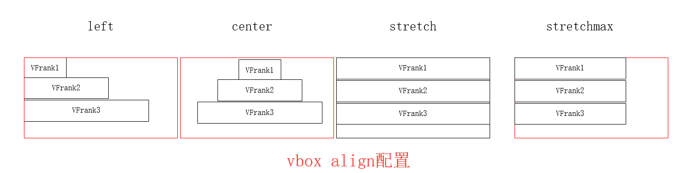
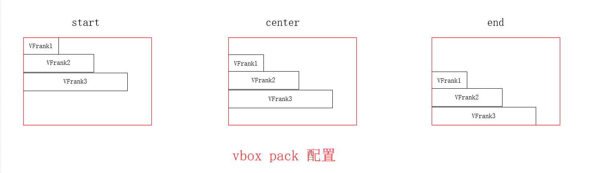
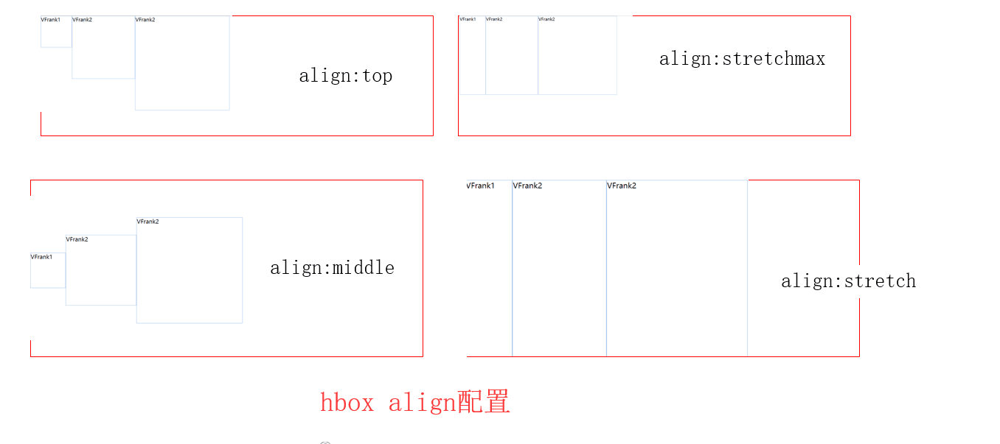
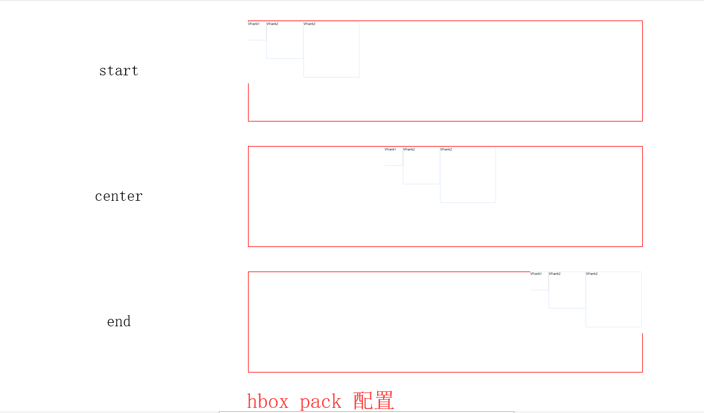

# Ext 常用布局

> hbox 和 vbox

- 一个是水平布局，一个是垂直方向的布局

- 总结vbox和hbox配置，**aligh 控制子组件对齐方式以及是否需要拉伸，pack控制子组件在父容器对齐轴线的位置（上中下/左中右）**

```javascript

// vbox
    new Ext.Container({
        width: 1000,
        cls: 'sf-wrap',
        layout: {
            type: 'vbox',
            
            align: 'stretchmax', // 控制左右
                //align支持的配置{left（默认值 左边垂直对齐）center（中间垂直对齐）stretch（宽度拉伸至与容器的宽度）stretchmax（宽度拉伸至与最宽的子组件的宽度）}

            pack: 'end' // 控制上下
                //pack支持的配置{ start（默认 容器上边 center(容器中间) end(容器的下边)}
        },
        items: [{
            width: 100,
            height: 50,
            html: 'VFrank1'
        }, {
            width: 200,
            height: 50,
            html: 'VFrank2'
        }, {
            width: 300,
            height: 50,
            html: 'VFrank2'
        }]
    })

````




````javascript

// hbox
    new Ext.Container({
        width: 1000,
        cls: 'sf-wrap',
        layout: {
            type: 'hbox',
            
            align: 'middle', // 控制上下
                //align支持的配置{top（默认 居上)middle（垂直居中）stretch（垂直拉伸至容器高度）stretchmax（垂直拉伸至最高高度的组件）

            pack: 'end' // 控制左右
                //pack支持的配置{ start（默认 容器左边 center(容器中间) end(容器的右边)}
        },
        items: [{
            width: 100,
            height: 100,
            html: 'VFrank1'
        }, {
            width: 200,
            height: 200,
            html: 'VFrank2'
        }, {
            width: 300,
            height: 300,
            html: 'VFrank2'
        }]
    })
````




> fit

- 当要求一个页面只显示一个组件的时候**注意：fit这种只能有一个子组件，如果放了多个组件，那么也只有一个子组件会起作用**

- 常见于一个页面显示一个表格（Grid这个需求还不少）

````javascript

// fit布局，这种情况只会显示VFrank1
    new Ext.Viewport({
        cls: 'sf-viewport',
        layout: 'fit',
        items: [
            new Ext.Container({
                html: 'VFrank1'
            }),
            new Ext.Container({
                html: 'VFrank2'
            })
        ]
    });

````

> border

- 边界布局，它将页面分隔成为:west,east,south,north,center这五个部分，需要在items中用region参数为它配置位置。
     
- north和south部分只能设置height，west和east部分只能设置。

- width，north south west east非必须配置，center必须有配置。

- 这个布局（结合fit使用）可以弥补fit布局中有两个item的时候，需要撑满一个屏幕

````javascript

// border， 这种使用方式可以把页面分为上下两块，撑满一个屏幕
    new Ext.Viewport({
        cls: 'sf-viewport',
        layout: 'fit',
        items: [
            new Ext.Container({
                cls: 'sf-wrap',
                layout: 'border',
                items: [{
                    region: 'north',
                    height: 80,
                    html: 'VFrank_Grid_Top'
                }, {
                    layout: 'fit',
                    region: 'center',
                    items: [{
                        xytpe: 'box',
                        html: 'VFrank_Grid_Fit'
                    }]
                }]
            })
        ]
    });

````